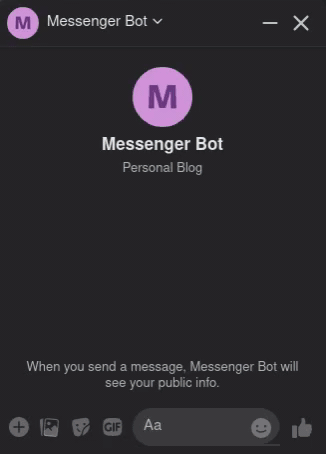

# Facebook Messenger Bot
The backend is currently deployed in https://mysterious-badlands-64487.herokuapp.com . 
You can also visit (and chat) the bot here: https://www.facebook.com/Messenger-Bot-106137254801293

You might need to wait for several seconds for the bot to reply in several occasions. Because the backend is deployed with Heroku (free plan), it will need time to start after a long period of inactivity.

## Demo

## How It Works
1. The user initiates the conversation by sending a text message first to the bot.
2. The bot will ask for the user's name. The user then replies with his/her name.
3. The bot will then ask for the user's birthdate (in YYYY-MM-DD format). The user then replies with his/her birthdate. If the format is not correct, the bot will prompt the user to input te birthdate again.
4. After the user replies with his/her format-corrected birthdate, the bot will ask the user if the user wants to know how many days remaining to his/her next birthday. Besides the question, the bot will also send quick replies option (Yes or No).
5. If the user replies with `yes, yea, yup, yeah, y, ok`, then the bot will send the remaining days. If the user replies with `no, nay, nope, nah`, then the bot will send `Goodbye` message. Else, the bot will prompt the user to reply again.
6. The bot will reset to initial state after the user answers the final question. (Go to the step 1).

## How To Install

### Prerequisites
Please install <b> Yarn</b>, <b> Node js</b>, and <b> Ngrok </b> to use this bot.

### Running The Bot
1. Clone this repository
2. Move to the diretory of the cloned repository, then run `yarn install`
3. Copy the `.env.example` file and rename it to `.env`. Then, assign all values needed in the `.env`
4. Type and execute `yarn start` in your terminal
5. The bot should be running on `http://localhost:PORT`. Use <b> Ngrok </b> to make it public.
6. Copy the Ngrok URL (HTTPS), add `/webhook` to the URL, and paste it to <b> Webhooks Settings</b>. For example, if the bot is running on `https://184af9aeda9c.ngrok.io`, then the pasted URL should be `https://184af9aeda9c.ngrok.io/webhook`.
7. Copy the verify token (random string provided by yourself), then paste it to <b> Webhooks Settings </b> as well.

## Endpoints
1. [POST] `/webhook`: Webhook endpoint where messages are being received and handled.
2. [GET] `/webhook`: Webhook endpoint to verify challenge provided by Messenger.
3. [GET] `/messages`: Get all messages received by the bot (sorted by newest to lowest message).
4. [GET] `/messages/:id`: Get a message by its id.
5. [DELETE] `/messages/:id`: Delete a message by its id.
